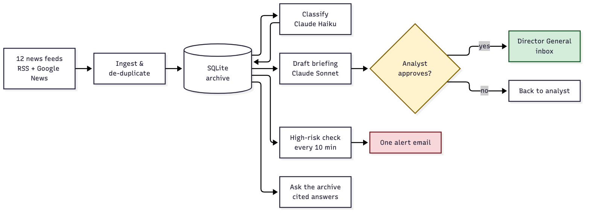
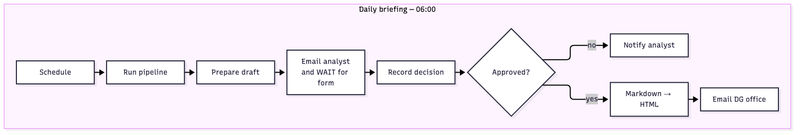
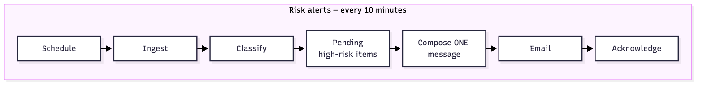
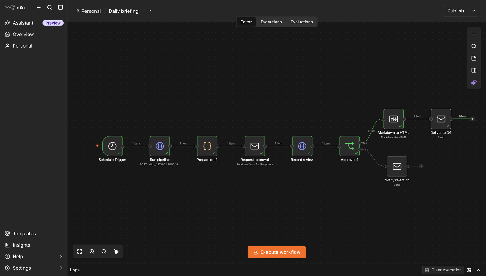
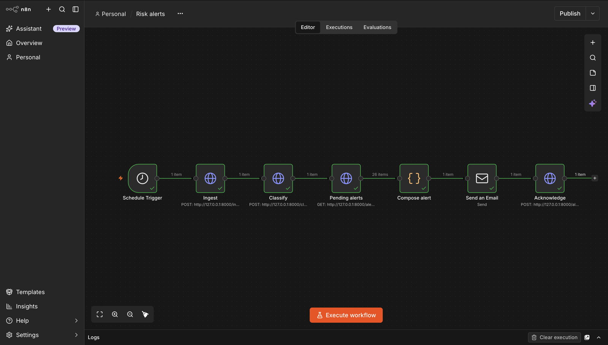
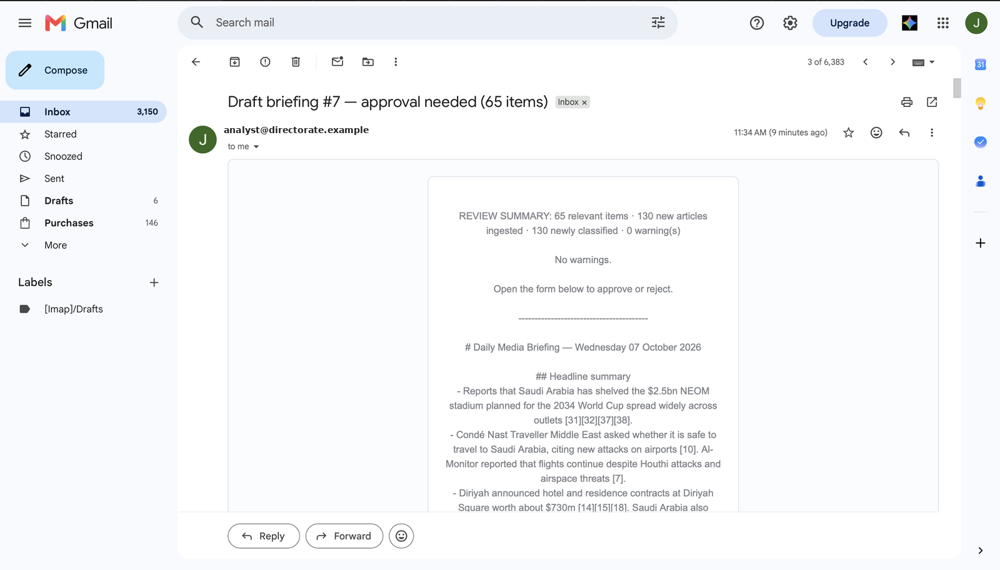
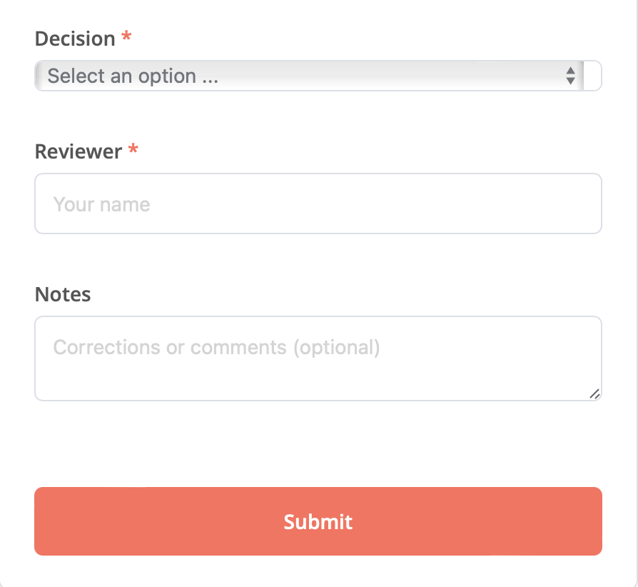
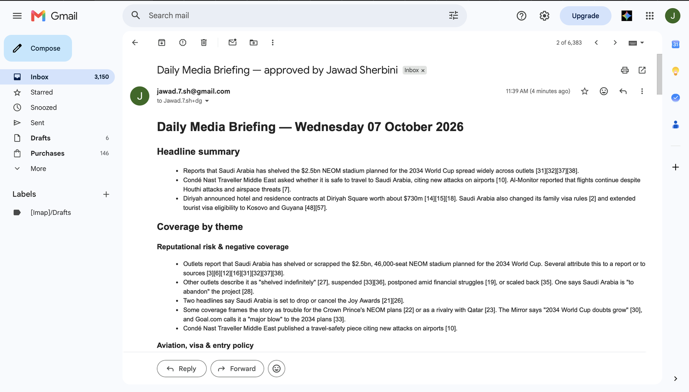
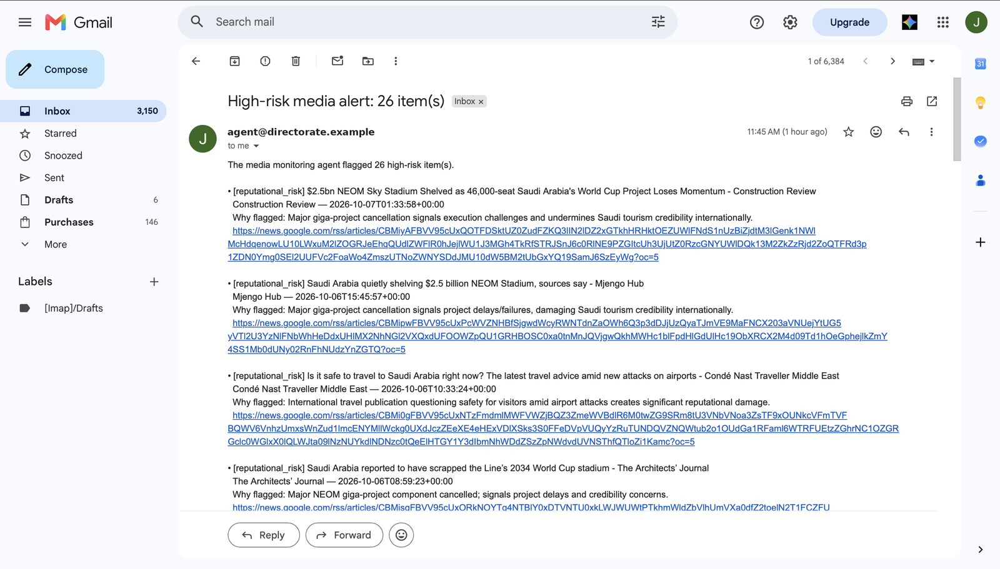
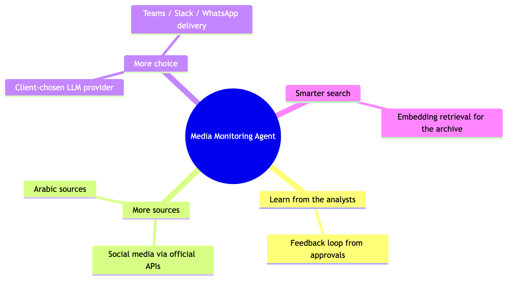

# Media Monitoring Agent

**Reads ~1,000 news items a day, drafts a fully cited briefing, and lets a human approve it before anyone senior sees it.** Built for a government communications team that was spending three analyst-hours every morning doing this by hand.

- Every claim in the briefing links to its source, and the code checks that no citation was invented.
- Nothing reaches the Director General without a named analyst clicking **Approve**.
- High-risk stories trigger one alert within 15 minutes, around the clock.
- Analysts can ask the archive questions in plain English and get a cited answer.

Stack: **Python · Anthropic Claude · n8n · SQLite**. Runs on one machine; the only data that leaves it is article text sent to the LLM API.

---

## How it works



*Diagram source: `docs/diagrams/*.mmd` (Mermaid).*

Each step is a plain Python function. n8n does the scheduling, the human approval and the delivery; it never contains logic of its own.

### The two n8n workflows





| Approved run of the daily workflow | Risk-alert workflow |
|---|---|
|  |  |

| The analyst's draft email | Approval form | What the Director General receives | A high-risk alert |
|---|---|---|---|
|  |  |  |  |

See a [complete generated briefing](docs/sample-briefing.md) (65 items, every citation verified) and [two archive Q&A answers](docs/sample-qa.md).

---

## Why you can trust what it sends

| Safeguard | How |
|---|---|
| **Human sign-off** | The draft goes to a named analyst; decision, name and time are stored. Rejected drafts never leave the building. |
| **No invented sources** | The model may only use the articles it is given. Code verifies every `[n]` citation points to one of them; anything else is flagged at the top of the draft. |
| **Honest about gaps** | It says when sources disagree, when an outlet is unnamed, and when two stories cannot be linked on the evidence. |
| **Risk rule in plain code** | High risk = negative + high priority + a sector theme. Readable and changeable by the client, not learned by a model. |
| **Measured** | 83% theme and 80% sentiment agreement with a human labeller on a blind sample — see [eval/RESULTS.md](eval/RESULTS.md). |
| **Loud failures** | Dead feeds, cut-off drafts and bad citations appear as warnings on the draft. A failing step stops the workflow instead of sending an empty briefing. |
| **Cost cannot run away** | Every call has an output cap, every step has an item cap, and a hard daily limit on classification calls (`DAILY_CLASSIFY_CAP`, default 3,000) stops a runaway feed or loop before it becomes a bill. A spend limit on the API key is the second backstop. |

## Security and data handling

| Concern | How it is handled |
|---|---|
| **Where the data lives** | n8n and the SQLite archive run inside the client's environment. The only outbound traffic is article text to the LLM API over HTTPS; nothing from the archive, the briefings or the approval decisions leaves. |
| **Secrets** | API keys live in `.env`, which is git-ignored; `.env.example` holds placeholders only. The pipeline refuses to start with a placeholder key. |
| **Access to the API** | Every endpoint except `/health` requires an API key, compared in constant time. n8n is the only caller. |
| **Untrusted input** | Articles are treated as data, never as instructions: the classifier's output is validated against a fixed label set, every citation in a draft is checked against the supplied items, and a human approves before anything is sent. A page containing "ignore your instructions" cannot change a label, invent a source, or reach the Director General. |
| **Audit trail** | Every briefing stores who approved or rejected it and when; n8n keeps a full execution history of every run. |
| **Production path** | HTTPS in front of n8n and the API, role-based access (analysts approve, DG office reads), Postgres with backups, and a regional LLM endpoint if policy requires data to stay in-Kingdom. |

---

## Why Anthropic Claude

The best fit for this job, chosen on three things that matter more than price at this volume:

1. **It follows citation rules.** Told to use only the supplied items and cite each claim, it does — and refuses to connect stories without evidence. That behaviour is the whole trust story.
2. **Two tiers, one key.** Haiku handles 1,500 cheap classifications a day; Sonnet writes the one document that matters. Same SDK, same key.
3. **A path to regional hosting** through the hyperscalers if the client needs data to stay in-Kingdom.

Total LLM cost at 1,500 items/day: **≈ $33 / month** (≈ $19 with prompt caching). A comparison with OpenAI, Google and Gulf-hosted options, and how a client would switch provider, is in [docs/llm-choice.md](docs/llm-choice.md).

---

## Quick start (under 15 minutes)

Needs Python 3.11+, Node.js 20+, an Anthropic API key, and a Gmail address with an app password.

```bash
git clone https://github.com/Jawadsherbini/media-monitoring-agent.git
cd media-monitoring-agent
python -m venv .venv && source .venv/bin/activate
pip install -r requirements.txt
cp .env.example .env      # then open .env and replace BOTH placeholder values

python check_feeds.py     # optional: all 12 sources respond
python -m agent.ingest    # fetch + de-duplicate into media.db
python -m agent.classify 150
python -m agent.briefing 72          # prints a briefing from the last 72 hours
python -m agent.ask "What has been written about visa changes this week and by whom?" 7

uvicorn api:app --port 8000          # leave running; n8n calls this
```

Then in a second terminal: `npx n8n` (Safari users: `N8N_SECURE_COOKIE=false npx n8n`), open http://localhost:5678, and follow [docs/n8n-setup.md](docs/n8n-setup.md) to import the two workflows (about 5 minutes). Use `127.0.0.1`, not `localhost`, in n8n URLs.

---

## What's next



| Idea | What it means | What the directorate gets |
|---|---|---|
| **Feedback loop** | Every approval, rejection and note becomes a measurement and a labelled example; common corrections are added to the prompt after review, and the evaluation set grows from the analysts' own labels | A quality number the Director can watch, and a system that improves from the analysts' own judgement — without ever learning automatically |
| **Social media, the same way as news** | Monitor public posts about Saudi tourism and its destinations on X, Instagram and TikTok — reading each platform through the door it provides for this purpose (X's official search API; a licensed listening feed for Instagram and TikTok), exactly as the news sources are read through RSS. Posts enter the pipeline as items, so classification, briefing, alerts and Q&A work unchanged; the risk rule gains a reach/velocity condition | Most people now get their news from social media. The directorate sees what the public is saying, not only what newspapers print — and a post spreading fast is flagged before it becomes a crisis |
| **Arabic sources** | The models already read Arabic; the work is feeds and a bilingual codebook | Coverage of the outlets the Saudi public actually reads |
| **Client-chosen LLM provider** | A setting behind the existing single swap point (`agent/llm.py`) | Procurement and data-residency rules decide the vendor; the evaluation set is re-run before any switch, so the choice is measured, not assumed |
| **More channels** | Teams, Slack and WhatsApp are each one n8n node on the approved branch | The briefing and alerts arrive where people already work |
| **Embedding retrieval** | Meaning-based search for the archive Q&A | Questions match meaning, not only keywords |

---

## Repository

| Path | What it is |
|---|---|
| `agent/` | `ingest.py` · `classify.py` · `briefing.py` · `ask.py` · `db.py` · `llm.py` (single LLM swap point) · `sources.py` |
| `api.py` | FastAPI endpoints n8n calls — [docs/api.md](docs/api.md) |
| `n8n/` | The two exported workflows (JSON) |
| `eval/` | Hand-labelled sample, scoring script, results, token measurement |
| `docs/` | [Architecture note](docs/architecture.md) (one page, [PDF](docs/architecture.pdf)) · [LLM choice](docs/llm-choice.md) · [n8n setup](docs/n8n-setup.md) · [API](docs/api.md) · samples · screenshots |
| `DECISIONS.md` | Every design decision and its trade-off, in order |

**Scope of this version.** De-duplication matches identical headlines, so one story carried by many outlets appears as several items — the briefing merges them and the alerts batch them, and story clustering is the natural next step. Archive search is keyword-based by design (transparent and fast); embedding retrieval adds meaning-based matching. Evaluation uses a 30-item hand-labelled sample with a written codebook, built so the client's analysts can extend it with their own labels. Google News items link through Google's redirect to the original article. The approval link is local because the whole prototype runs on one machine; in deployment n8n sits on a server inside the client's network.
